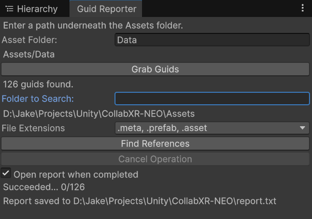

# Unity Guid Reporter
A Unity package designed to make refactoring and bulk asset removal less painful, since Unity's built in project search tools are extremely limited. Guid Reporter searches directories of assets recursively, and spits out exhaustive lists of all references to these GUIDs.

## Usage
* To open the editor window, navigate to Envision > Guid Reporter
* Under `Asset Folder` input the (relative) path underneath the Assets folder with the assets you wish to find references to.
* Click the `Grab Guids` button.
* Under `Folder to Search`, you may leave this blank to search all Assets. Otherwise, specify a (relative) path to search for asset references.
* Click `Find References` and wait a minute. When done, the file path of the report will be displayed!
